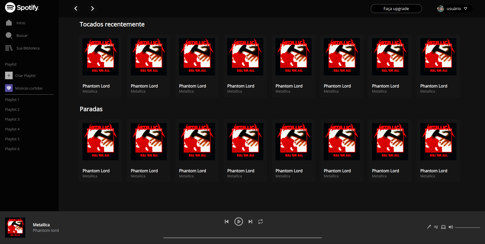

<h1>Clone da interface inicial do web player do spotify</h1>

Clone da interface inicial do spotify. Este projeto foi feito para treinar alguns conceitos de ReactJs e css, logo conteúdos como imagens e textos são estáticos e não dinâmicos.

<b>obs: A versão mobile não foi implementada</b>

